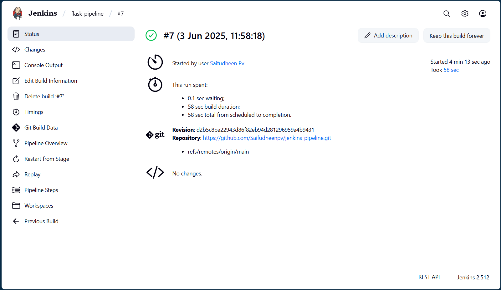

Jenkins CI/CD Pipeline Project

This project demonstrates a CI/CD pipeline using Jenkins to automate building, linting, and testing a Python Flask web app. The pipeline ensures code quality and functionality, showcasing real-world DevOps automation skills for software delivery.

Features

Simple Flask app with one endpoint (/).

Unit tests with pytest.

Linting with Flake8 for code quality.

Jenkins pipeline (Jenkinsfile) for CI/CD automation.

Professional GitHub documentation.

Prerequisites

Jenkins

Java JDK (17 recommended)

Python 3.8+

Git

GitHub account

Setup Instructions

Clone the repository:

git clone https://github.com/your-username/jenkins-pipeline.git
cd jenkins-pipeline

Install dependencies locally:

python -m venv venv
venv\Scripts\activate
pip install -r requirements.txt

Run the app:

python app.py

Visit http://127.0.0.1:5000/ to see "Hello, Jenkins CI/CD!".

Run tests and linting:

flake8 app.py test_app.py
pytest

Set up Jenkins:

Install Jenkins and Java (jenkins.io).

Configure Python and Git in Jenkins PATH.

Create a pipeline job:

Name: flask-pipeline.

Pipeline: SCM, Git, URL https://github.com/your-username/jenkins-pipeline.git, Branch main, Script Path Jenkinsfile.

Run the pipeline in Jenkins.

Jenkins Pipeline

## Screenshot

Jenkinsfile: Defines a pipeline with:

Build: Creates virtual environment, installs dependencies.

Lint: Runs Flake8.

Test: Runs pytest.

Uses Windows batch commands (bat).

Deactivates virtual environment in post step.

Challenges Faced

Configured Jenkins on Windows with Java and PATH setup.

Learned Jenkins pipeline syntax and Jenkinsfile creation.

Debugged Windows-specific batch commands for virtual environment.

Ensured Flake8 and pytest compatibility in Jenkins.

Future Improvements

Add a deployment stage (e.g., to AWS or Docker Hub).

Integrate test coverage reporting (e.g., coverage.py).

Add parallel pipeline stages for efficiency.

Author

Your Name (GitHub)

Connect on LinkedIn